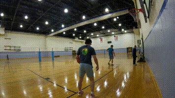
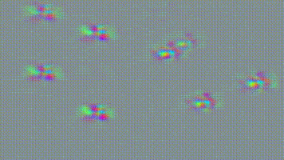

# :movie_camera: :seal: Video Seal: Open and Efficient Video Watermarking


Official implementation of [Video Seal](https://ai.meta.com/research/publications/video-seal-open-and-efficient-video-watermarking/): training and inference code for video watermarking, and state-of-the-art open-sourced models.

This repository includes pre-trained models, training code, inference code, and evaluation tools, all released under the MIT license, as well as baselines of state-of-the-art image watermarking models adapted for video watermarking (including MBRS, CIN, TrustMark, and WAM) allowing for free use, modification, and distribution of the code and models. 
<!-- Our approach leverages temporal watermark propagation, a novel technique that converts any image watermarking model into an efficient video watermarking model, eliminating the need to watermark every frame in a video. We also propose a multistage training regimen that includes image pre-training, hybrid post-training, and extractor fine-tuning, supplemented with a range of differentiable augmentations. 
-->

[[`paper`](https://ai.meta.com/research/publications/video-seal-open-and-efficient-video-watermarking/)]
[[`arXiv`](https://arxiv.org/abs/2412.09492)]
[[`Colab`](https://colab.research.google.com/github/facebookresearch/videoseal/blob/main/notebooks/colab.ipynb)]
[[`Demo`](https://aidemos.meta.com/videoseal)]

| Original | Video Seal output | The watermark (normalized for visibility)|
|---|---|---|
|  |  |  |


## Quick start

```python
import torchvision
import videoseal
from videoseal.evals.metrics import bit_accuracy

# Load video and normalize to [0, 1]
video_path = "assets/videos/1.mp4"
video = torchvision.io.read_video(video_path, output_format="TCHW")
video = video.float() / 255.0

# Load the model
model = videoseal.load("videoseal")

# Video Watermarking
outputs = model.embed(video, is_video=True) # this will embed a random msg
video_w = outputs["imgs_w"] # the watermarked video
msgs = outputs["msgs"] # the embedded message

# Extract the watermark message
msg_extracted = model.extract_message(video_w, aggregation="avg", is_video=True)

# VideoSeal can do Image Watermarking
img = video[0:1] # 1 x C x H x W
outputs = model.embed(img, is_video=False)
img_w = outputs["imgs_w"] # the watermarked image
msg_extracted = model.extract_message(imgs_w, aggregation="avg", is_video=False)
```


## Installation

### Requirements

Version of Python is 3.10 (pytorch 2.5.1, torchvision 0.20.1, torchaudio 2.5.1, cuda 12.1).
Install pytorch:

```
pip3 install torch torchvision torchaudio --index-url https://download.pytorch.org/whl/cu121

pip install -e . 
```

For training, we also recommend using decord:
```
pip install decord
```
Note that there are some issues with installing decord: https://github.com/dmlc/decord/issues/213
Everything should be working without decord for inference, but there may be issues for training in this case.

### Download the Video Seal model

The video model is automatically downloaded through Hugging Face by doing `videoseal.load("videoseal")`.
If you wish to download the model manually, you can do so by running the following command:
```bash
wget https://dl.fbaipublicfiles.com/videoseal/checkpoint.pth
```
(or click [here](https://dl.fbaipublicfiles.com/videoseal/checkpoint.pth)).
You then have to update the checkpoint path in the [model card](videoseal/cards/videoseal.yaml) file.

### Download the other models used as baselines

We do not own any third-party models, so you have to download them manually.
We provide a guide on how to download the models at [docs/baselines.md](docs/baselines.md).

### VMAF

We provide a guide on how to check and install VMAF at [docs/vmaf.md](docs/vmaf.md).


## Inference

### Audio-visual watermarking

[`inference_av.py`](inference_av.py) 

To watermark both audio and video from a video file.
It loads the full video in memory, so it is not suitable for long videos.

Example:
```bash
python inference_av.py --input assets/videos/1.mp4 --output_dir outputs/
python inference_av.py --detect --input outputs/1.mp4
```


### Streaming embedding and extraction

[`inference_streaming.py`](inference_streaming.py) 

To watermark a video file in streaming.
It loads the video clips by clips, so it is suitable for long videos, even on laptops.

Example:
```bash
python inference_streaming.py --input assets/videos/1.mp4 --output_dir outputs/
```
Will output the watermarked video in `outputs/1.mp4` and the binary message in `outputs/1.txt`.

### Full evaluation

[`videoseal/evals/full.py`](videoseal/evals/full.py)

To run full evaluation of models and baselines.

Example to evaluate a trained model:
```bash
python -m videoseal.evals.full \
    --checkpoint /path/to/videoseal/checkpoint.pth \
```
or, to run a given baseline:
```bash
python -m videoseal.evals.full \
    --checkpoint baseline/wam \
``` 


## Training

Example run of a simple run on a node of 8 GPUs:
```
torchrun --nproc_per_node=8  train.py --local_rank 0 --debug_slurm \
  --balanced True --total_gnorm 1.0 --lambda_dec 1.0 --lambda_det 0.0 --lambda_d 0.1 --lambda_i 0.5 \
  --scaling_w 1.0 --scaling_i 1.0 --nbits 96 --perceptual_loss mse --seed 444 \
  --scheduler CosineLRScheduler,lr_min=1e-6,t_initial=1000,warmup_lr_init=1e-8,warmup_t=50 --optimizer AdamW,lr=1e-5 \
  --epochs 1000 --eval_freq 5 --full_eval_freq 5 --batch_size_video_eval 1 --batch_size_video 1 --batch_size_eval 32 --batch_size 16 --iter_per_valid 10 \
  --videoseal_step_size 16 --video_start 800 --prop_img_vid 0.5 --iter_per_epoch 1500 \
  --extractor_model sam_small --embedder_model unet_small2 --augmentation_config configs/augs.yaml \
```


## License

The model is licensed under an [MIT license](LICENSE).

## Contributing

See [contributing](.github/CONTRIBUTING.md) and the [code of conduct](.github/CODE_OF_CONDUCT.md).

## See Also

- [**AudioSeal**](https://github.com/facebookresearch/audioseal)
- [**Watermark-Anything**](https://github.com/facebookresearch/watermark-anything/)

## Citation

If you find this repository useful, please consider giving a star :star: and please cite as:

```bibtex
@article{fernandez2024video,
  title={Video Seal: Open and Efficient Video Watermarking},
  author={Fernandez, Pierre and Elsahar, Hady and Yalniz, I. Zeki and Mourachko, Alexandre},
  journal={arXiv preprint arXiv:2412.09492},
  year={2024}
}
